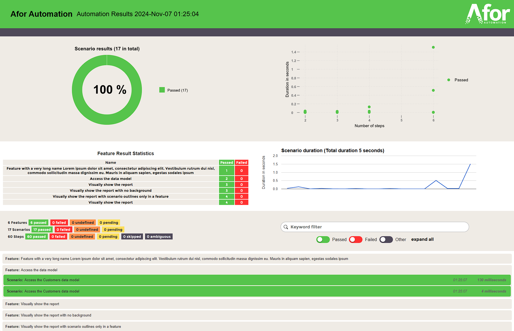

# Afor Automation Test Framework

The Afor framework is designed to allow creating automated test suites, which can target various applications and
services such as web browser based applications, REST and SOAP services, native and hybrid mobile applications.\
Other applications can be added into the framework as desired, such as windows application capabilities.

## Reports

Make use of consistent reports across your automation, regardless of the system you are testing against. \
The reports should be available in your projects `target/afor` directory. \
The reports show high level information at the top of the report, with in-depth details further down.


## Example test suite

To help get you started, a test suite which shows examples of both web browser based features and REST service features
can be found under [afor-example](https://github.com/afor-automation/afor/tree/master/afor-example)

## Getting started / Installation

The framework requires jdk 21 or later, maven, an IDE of your choice (unless running headless), along with a browser and
associated drivers if performing web browser testing or simulators/real devices and appium if testing mobile
applications.

### Basic installation for Web and Service automation

* Download and install JDK 21 or later \
  if on Linux or MacOS then it is recommended to use a package manager to install
* Install Chrome or a browser of your choice, if behind a proxy then you may need to download the relevant drivers
  manually and put them into your path \
  [Chrome and chromedriver](https://googlechromelabs.github.io/chrome-for-testing/) are often used, however other
  browsers are also supported.
* Install an IDE of your choice, such as [Intellij Idea](https://www.jetbrains.com/idea/)
  or [Eclipse](https://www.eclipse.org/topics/ide/) \
  If your are running headless, such as in a pipeline then this step is not required

### Additional installation steps for Mobile automation

* Download and install [npm](https://www.npmjs.com/package/npm)
* [Install appium](https://appium.io/docs/en/latest/quickstart/install/) `npm install -g appium`
* Install [Android Studio](https://developer.android.com/studio/install)
  and [set up a new virtual device](https://developer.android.com/studio/run/managing-avds) under AVD Manager
* If running on MacOS, download and install [XCode](https://developer.apple.com/xcode/) and set up
  a [new simulator](https://developer.apple.com/documentation/safari-developer-tools/installing-xcode-and-simulators)
* If you intend on automating iOS, either run them from a Mac or using a cloud based device from a provider such as
  Sauce labs or Test object

## Running the automation

To run the automation features from your IDE, create a new JUnit run configuration against the RunTest unit test.\
The parameters for the test suite allow different scenarios to be run.

| Description                                                                                               | Example                                                                                                                    |
|-----------------------------------------------------------------------------------------------------------|----------------------------------------------------------------------------------------------------------------------------|
| Run all scenarios which have test tags In dev environment, using chrome as the browser                    | -Dspring.profiles.active=dev -Dcucumber.filter.tags="@test" -Dselenide.browser=chrome                                      |
| Run all scenarios which don’t have wip or opendefect tags In dev environment, using chrome as the browser | -Dspring.profiles.active=dev -Dcucumber.filter.tags="not @wip and not @opendefect" -Dselenide.browser=chrome               |
| Run the scenario on line 7 of GoogleSearch.feature In dev environment, using chrome as the browser        | -Dspring.profiles.active=dev -Dcucumber.features="classpath:features/web/GoogleSearch.feature:7" -Dselenide.browser=chrome |
| Running a scenario, using maven from the command line or from a build server                              | mvn test -Dspring.profiles.active=dev -Dcucumber.filter.tags="not @wip and not @opendefect" -Dselenide.browser=chrome      |

## Interacting with a web page

Under the features directory, you will find a feature named `GoogleSearch.feature` \
This is a browser based feature, which searches for a term and validates the results on the page

The feature uses natural language to describe a scenario, which searches for keywords using the search engine

```
Scenario: Search for an example piece of text
  Given I am on the home page
  When I search for "afor automation"
  Then I should see some search results
```

A step definition is created for each of the steps in the search feature

```
When("^I search for \"([^\"]*)\"$", (String searchString) -> googleView.search(searchString));
```

The `GoogleView` class contains methods to return fields on the page, note that the page is annotated with a
`@Component` annotation - this allows us to use properties and other parts of the framework in our classes.

```
@Component
public class GoogleView {
    public SelenideElement getSearchField() {
        return $(By.name("q"));
    }
```

The view exposes a method to wrap up performing a web search, this is the method used in the step definitions\
Assertions such as `should(exist)` both prove that the content is loading as expected, however it also enables stability
as the automation framework will poll page elements until the condition is met or until a timeout occurs.

```    
public void search(String searchString) {
    getSearchButton().should(exist);
    getSearchField().click();
    getSearchField().should(be(focused));
    getSearchField().setValue(searchString);
    getSearchButton().click();
}
```

## Calling a service

Service calls such as REST services or SOAP services are used in the framework in a similar way to browser based
testing.

The `RestApi.feature` contains REST service calls, to show how to run GET and POST requests to endpoints.\
The service calls use data models to serialise responses.

```
Scenario: Get a list of Posts from a REST service
  When I call the GET Posts service
  Then the GET Posts response code should be 200
  And the response should have a lists of Posts
```

The step definition for the service call is as follows, returning a service response\
In this case, the example step definition uses the classic style rather lambda expressions. Either option is suitable

```
@When("^I call the GET Posts service$")
public void iCallTheGETPostsService() {
    getPostsResponse = postsApi.getPosts();
}
```

The `PostsApi` class uses the `Get` and `Post` classes from the framework, in order to call the REST services\
Note that the `api.posts.uri` value is used as the URI to call the service and is defined in the
`application.properties` or test environment properties.

The load order of properties is `application.properties` first, then environment specific properties, finally by runtime
properties.\
This allows overriding property values for each test environment or at runtime.

```
@Component
public class PostsApi {
    @Autowired
    Get get;

    @Autowired
    Post post;

    @Value("${api.posts.uri}")
    String apiPostsUri;
```

When it comes to calling the API, the get or post request is able to serialise the response back as an object.\
In the example, the data model is used to serialise responses.\
First the headers are set to define the acceptable response types, followed by the get request call to the endpoint with
the expected response type.

```
public ResponseEntity<nz.co.afor.model.Post[]> getPosts() {
    get.getHeaders().set(HttpHeaders.ACCEPT, String.valueOf(MediaType.APPLICATION_JSON));
    return get.request(apiPostsUri, nz.co.afor.model.Post[].class);
}
```

## Viewing reports

After running the test suite, you can view the reports under `target/afor/index.html`

## Other configuration properties

There are many other options available to configure through your configuration properties or at runtime\
A list of possible configuration options are available below

### AI Configuration

- `nz.co.afor.ai.key`: The API key used to authenticate requests to the AI service. The environment variable `AI_KEY`
  may also be used as an alternative
- `nz.co.afor.ai.endpoint`: The endpoint URL for the AI service (e.g., `https://example.openai.azure.com`). The
  environment variable `AI_ENDPOINT` may also be used as an alternative
- `nz.co.afor.ai.openapisecretkey`: The secret key for OpenAPI authentication (used for secure communication with the AI
  service). The environment variable `AI_SECRET_KEY` may also be used as an alternative
- `nz.co.afor.ai.model`: The AI model to be used (e.g., `gpt-4o`, `gpt-4o-mini`).
- `nz.co.afor.ai.request.chunksize`: The size of each chunk when sending requests to the AI service (used for handling
  large data payloads).
- `nz.co.afor.ai.request.maxsize`: The maximum payload size to send to the AI service

#### Web AI Cache Configuration

- `nz.co.afor.web.ai.cache.location`: The location where the AI cache is stored for web-based AI operations.
- `nz.co.afor.web.ai.cache.revalidate`: Whether the web AI cache should be revalidated (e.g., `true` to revalidate on
  each request).

#### Mobile AI Cache Configuration

- `nz.co.afor.mobile.ai.cache.location`: The location where the AI cache is stored for mobile-based AI operations.
- `nz.co.afor.mobile.ai.cache.revalidate`: Whether the mobile AI cache should be revalidated (e.g., `true` to revalidate
  on each request).

### Afor-API

#### Proxy configuration

- `proxy.username`: The username for proxy authentication.
- `proxy.password`: The password for proxy authentication.
- `proxy.domain`: The domain for proxy authentication.
- `proxy.address`: The address of the proxy server.

#### Connection pooling

- `api.ssl.selfsigned`: Indicates whether to allow self-signed SSL certificates.
- `api.pool.connections.max`: The maximum number of connections allowed in the connection pool.
- `api.pool.connections.route.max`: The maximum number of connections allowed per route in the connection pool.
- `api.pool.inactivity.validate`: Specifies the time (in milliseconds) to validate inactive connections.
- `api.pool.connections.timeToLive`: The maximum time (in milliseconds) a connection is kept alive in the pool.
- `api.pool.connect.timeout`: The time (in milliseconds) to wait for a connection to be established.
- `api.pool.socket.timeout`: The time (in milliseconds) to wait for a socket to read data.

### Afor-core

#### Encryption configuration

- `nz.co.afor.encrypt.key`: The encryption key used for encrypting data. The environment variable `ENCRYPT_KEY` may also
  be used as an alternative
- `nz.co.afor.encrypt.algorithm`: The encryption algorithm to be used
- `nz.co.afor.encrypt.key.algorithm`: The algorithm used for key generation
- `nz.co.afor.encrypt.iv`: The initialization vector (IV) used for encryption. The environment variable `ENCRYPT_IV` may
  also be used as an alternative

#### Fixtures

- `nz.co.afor.fixture.dateformat`: The format for displaying dates in the fixture (e.g., `yyyy-MM-dd`).
- `nz.co.afor.fixture.timezone`: The timezone used for the fixture's date and time (e.g., `UTC`, `GMT`).
- `nz.co.afor.fixture.path`: The path to the fixture file or directory.

### Afor-cucumber

- `nz.co.afor.report.heading`: The heading text to be displayed at the top of the report.
- `nz.co.afor.report.title`: The title of the report.
- `nz.co.afor.report.date.format`: The format used for displaying the date in the report (e.g., `yyyy-MM-dd`,
  `MM/dd/yyyy`).
- `nz.co.afor.report.date.timezone`: The timezone used for displaying the date in the report (e.g., `UTC`,
  `America/New_York`).

### Afor-mobile

- `appium.remote.url`: The URL of the remote Appium server.
- `appium.platformName`: The name of the mobile platform (e.g., `Android`, `iOS`).
- `appium.platformVersion`: The version of the mobile platform (e.g., `10.0`, `14.4`).
- `appium.deviceName`: The name of the device (e.g., `iPhone 12`, `Pixel 4`).
- `appium.udid`: The unique device identifier (UDID) for the device.
- `appium.app`: The path to the application to be tested (APK for Android, IPA or .APP for iOS).
- `appium.appPackage`: The package name of the Android app.
- `appium.browser`: The path or URL of a mobile web browser to test on.
- `appium.browserName`: The name of the browser to use for testing (e.g., `Chrome`, `Safari`).
- `appium.newCommandTimeout`: The time (in seconds) to wait for a new command before the session times out.
- `appium.orientation`: The initial screen orientation (e.g., `PORTRAIT`, `LANDSCAPE`).
- `appium.autoWebview`: Indicates whether to automatically switch to the webview context when interacting with a web
  app.
- `appium.noReset`: Whether to avoid resetting app state before the session starts (`true` to keep the app data intact).
- `appium.fullReset`: Whether to perform a full reset (clear app data and cache) before the session starts.
- `appium.autoGrantPermissions`: Whether to automatically grant app permissions on startup (`true` to grant).
- `appium.automationName`: The automation engine to be used (e.g., `UiAutomator2`, `XCUITest`).
- `appium.nativeScreenshot`: Whether to capture native screenshots (`true` to capture).
- `appium.recreateChromeDriverSessions`: Whether to recreate ChromeDriver sessions when necessary (e.g., for Chrome
  browser automation).
- `appium.appiumVersion`: The version of Appium being used for the session.
- `appium.deviceOrientation`: The orientation of the device (`PORTRAIT` or `LANDSCAPE`).
- `appium.ignoreUnimportantViews`: Whether to ignore views that are not important for the automation task (`true` to
  ignore).
- `appium.phoneOnly`: Whether to limit tests to phones only (ignores tablets if set to `true`).
- `appium.testobjectApiKey`: The API key for integration with TestObject, used for cloud testing.
- `appium.testobjectSessionCreateTimeout`: The timeout (in seconds) for creating a session with TestObject/SauceLabs.
- `appium.idleTimeout`: The time (in seconds) the Appium server waits before timing out an idle session.
- `appium.maxDuration`: The maximum duration (in seconds) for a session to run before it times out.
- `appium.uiautomator2ServerLaunchTimeout`: The timeout (in milliseconds) for launching the UiAutomator2 server.
- `appium.remote`: The URL of the remote Appium server (often used when connecting to a grid or cloud-based service).
- `appium.bundleId`: The bundle ID of the iOS app to be tested.

### Afor-web

- `selenide.browser`: The web browser to be used for the tests (e.g., `chrome`, `firefox`, `edge`).
- `selenide.baseUrl`: The base URL to be used for all relative URLs in the tests (e.g., `http://localhost:8080`).
- `selenide.timeout`: The default timeout (in milliseconds) for all Selenide actions, such as waiting for elements to
  appear.
- `selenide.pollingInterval`: The interval (in milliseconds) for polling while waiting for an element or condition to be
  met (e.g., waiting for visibility or clickability).